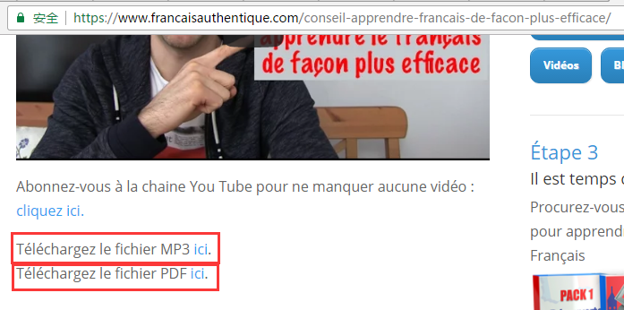

# podcast-downloader
A python web crawler for automatically downloading archive podcasts from Authentique Francais

====
##Table of Content
* [Background](#background)
* [Implementation](#implementation)
    * [Retrieve menu page](#retrieve-menu-page)

##Background
-----
Puisque je déménage bientôt à Montréal, c'est le temps de pratiquer beaucoup Le français.Tout d'abord, grâce à Johan, son [Français Authentique](https://www.francaisauthentique.com) est vraiment une excellente source pour améliorer le français oral.  
After follow his free course and pack1 courses, I decided to download all his podcast mp3 & pdf, then listen to them every day. As he suggests: 'Ecouter et Repeter'. All his podcast can be found on the [Archive Page](https://www.francaisauthentique.com/archive/).
If I manually download those files, I have to go into each podcast page:

And find the downloading link then download both the mp3 and pdf files.
This is a boring job, so I decided to use the 'to be wasted time' to practice my coding skill...

##Implementation
-----
###Retrieve menu page  
-----
First thing is to retrieve the menug page.  
```python
pip install urllib
```
```python
import urllib
response = urllib.urlopen('https://www.francaisauthentique.com/archive')
html = response.read()
```
Succeed, this page is very friendly to scrawlers :) Analyze the html, found that my interest part is as below:
```html
<h3>janvier 2017</h3>
<ul>
<li><span>13 janvier - </span> <span><a href="https://www.francaisauthentique.com/conseil-apprendre-francais-de-facon-plus-efficace/">Un conseil pour apprendre le français de façon plus efficace</a></span></li>
<li><span>11 janvier - </span> <span><a href="https://www.francaisauthentique.com/ce-se-ou-ceux/">Ce, se ou ceux ?</a></span></li>
<li><span>9 janvier - </span> <span><a href="https://www.francaisauthentique.com/invention-francaise-velo/">Une invention française : le vélo</a></span></li>
...
...
...
```

